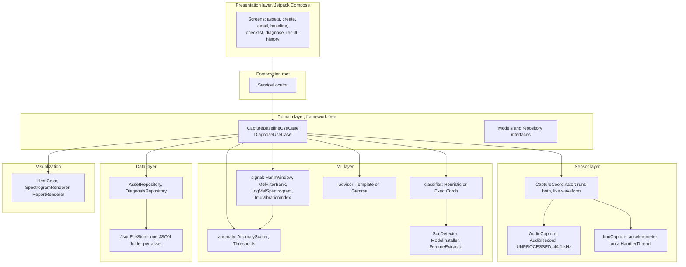
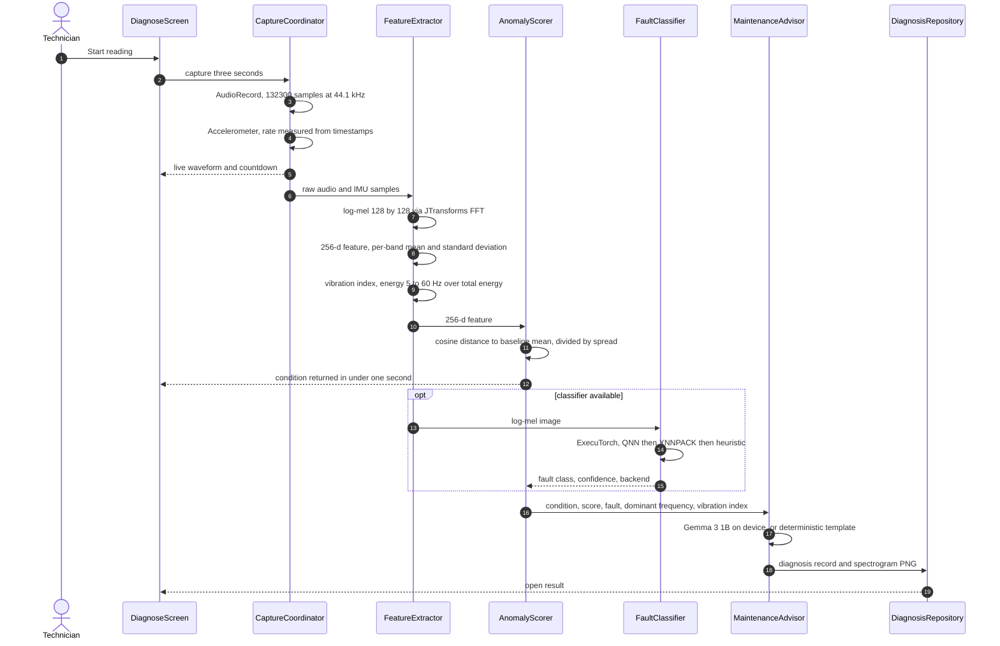
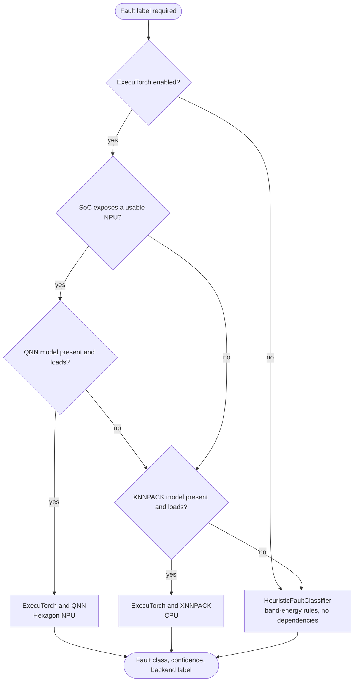
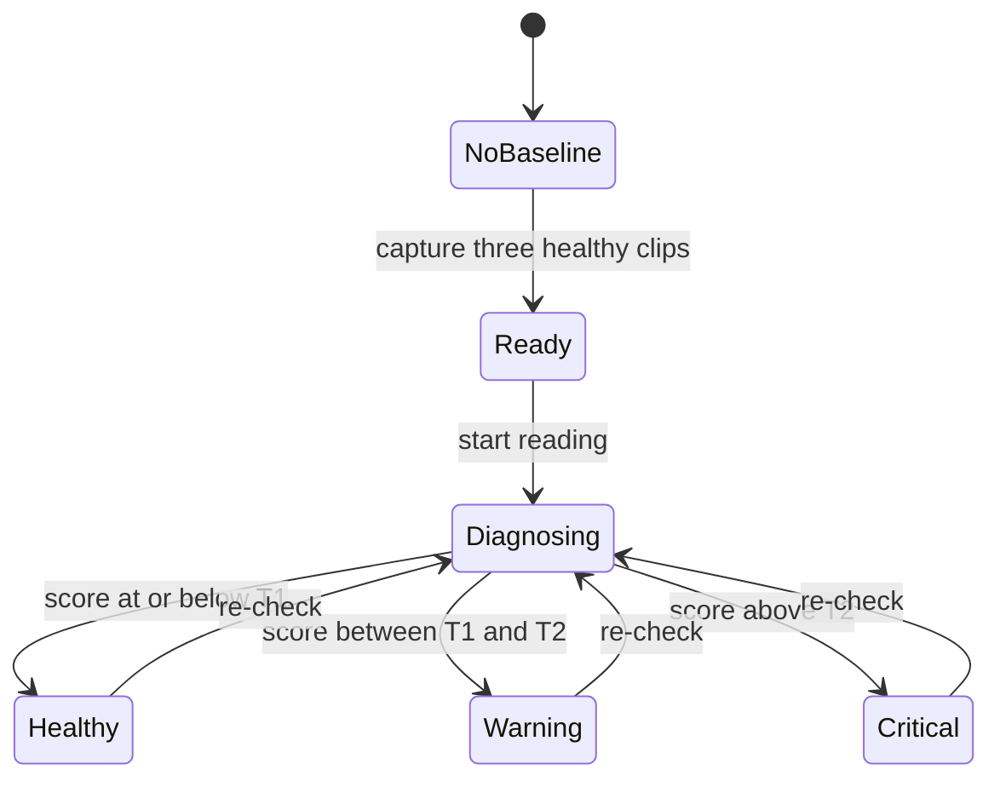
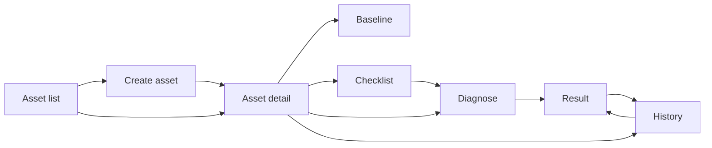

# Jugaad Agent

Jugaad Agent turns an ordinary Android phone, placed on a machine housing, into a
combined vibration and acoustic sensor for rotating equipment. It records a short
healthy reference for each machine, then reports a Healthy / Warning / Critical
condition, an optional fault class, and a plain-language recommended action on
every subsequent check.

All processing runs on the device. There is no `INTERNET` permission: signal
capture, feature extraction, anomaly scoring, the classifier and the language
model all execute locally, and records are stored as JSON in the app's private
files directory.

## Key properties

- **Offline by design.** No network permission, no cloud dependency.
- **No training data needed.** Each asset is characterised from a 12-second
  healthy baseline; the primary decision path is unsupervised.
- **Single device, two sensors.** The microphone and the accelerometer are
  sampled over the same three-second window and analysed together.
- **Hardware-aware inference.** The optional CNN runs through PyTorch ExecuTorch,
  selecting the Hexagon NPU (QNN) on capable Snapdragon parts and falling back to
  the CPU (XNNPACK) elsewhere, with a dependency-free heuristic as a final
  fallback.
- **Targets** Snapdragon 8 Elite–class devices as the primary platform, with a
  functional CPU path for mid-range hardware.

## Workflow

| Step | Screen | Description |
|------|--------|-------------|
| 1. Register an asset | `CreateAssetScreen` | Name the machine and, optionally, capture a nameplate photograph with CameraX. |
| 2. Capture a baseline | `BaselineScreen` | Record three three-second clips while the machine runs normally. The app stores the mean 256-dimension log-mel feature vector, the spread of the healthy cluster, and the mean vibration index. |
| 3. Pre-check | `ChecklistScreen` | Verify microphone permission, accelerometer availability, the presence of a baseline, and that the phone is resting still against the housing. |
| 4. Diagnose | `DiagnoseScreen` | Record one three-second clip. The app computes an anomaly score, and — when the machine is not healthy — a CNN fault class and a recommended action. |
| 5. Review | `ResultScreen` | Condition indicator, animated spectrogram, recommended action, active inference backend, and an offline PNG report that can be shared through the system share sheet. |

## Architecture

The project follows a layered structure with a framework-free domain layer and a
hand-rolled composition root.



## Processing pipeline



## Signal processing

Every parameter is defined once in `app/build.gradle.kts` as a `buildConfigField`,
mirrored in `core/Constants.kt`, and reproduced by `ml/logmel_reference.py` so the
on-device front end and the reference implementation stay aligned.

| Parameter | Value |
|-----------|-------|
| Sample rate | 44 100 Hz, mono, 16-bit |
| Clip length | 3 s, 132 300 samples |
| STFT | window 2048, hop 1024, periodic Hann, no centring |
| Mel filter bank | 128 bands, 20 Hz to 11 kHz, HTK scale, unnormalised |
| Compression | natural log of mel power plus 1e-6 |
| Output image | 128 mel bins by 128 frames |
| Feature vector | 256-d, per-band mean concatenated with per-band standard deviation |
| Vibration index | linear detrend, Hann window, FFT, ratio of 5 to 60 Hz energy to total |

The vibration index band requires only about 120 Hz of sampling, so it remains
valid where the accelerometer stream is limited to 200 Hz.

## On-device inference strategy



- **Classifier.** Input `1 by 128 by 128`, four depthwise-separable blocks, global
  average pooling, softmax over `Healthy`, `Rotor Imbalance` and
  `Airflow Obstruction`. Approximately 60 000 parameters. The XNNPACK path targets
  sub-second latency; the QNN path emits `[Qnn...]` lines to the system log.
- **Recommended action.** Generated by Gemma 3 1B (4-bit) through the MediaPipe
  LLM Inference API from a fixed prompt (`AdvicePrompt.build`). If the runtime or
  model is absent, a deterministic `TemplateAdvisor` produces equivalent guidance.
- Both runtimes are loaded by reflection, so the project compiles with the
  feature flags disabled and activates the runtimes automatically once the
  libraries and model files are present.

## Decision logic



The anomaly score is the cosine distance between the current 256-d feature and the
baseline mean, divided by the spread of the healthy cluster (the mean distance of
the three baseline clips to their own mean, with a lower bound to prevent
division by a near-zero value). The thresholds `T1` and `T2` default to 2 and 4
and are adjustable per asset.

## Screen map



## Module layout

```
app/src/main/java/com/jugaad/agent/
  core/         Constants, Outcome, logging
  sensor/       AudioCapture, ImuCapture, CaptureCoordinator
  ml/
    signal/     HannWindow, MelFilterBank, LogMelSpectrogram, ImuVibrationIndex
    anomaly/    AnomalyScorer, Thresholds
    classifier/ FaultClassifier, HeuristicFaultClassifier, ExecuTorchFaultClassifier
    advisor/    MaintenanceAdvisor, TemplateAdvisor, GemmaAdvisor, AdvicePrompt
    executorch/ SocDetector
    FeatureExtractor, ModelInstaller
  domain/       models, repository interfaces, use cases
  data/         DTOs, JsonFileStore, repository implementations
  viz/          HeatColor, AndroidSpectrogramRenderer, ReportRenderer
  ui/           theme, shared components, navigation, one package per screen
  di/           ServiceLocator
app/src/test/   LogMelSpectrogramTest, AnomalyScorerTest
ml/             model.py, train_cnn.py, export_executorch.py, logmel_reference.py
```

## Building

Requirements: Android Studio Ladybug or newer, Android Gradle Plugin 8.7, JDK 17,
Android SDK 35.

```bash
gradle wrapper --gradle-version 8.11.1   # first checkout only
./gradlew :app:assembleDebug
./gradlew :app:installDebug
```

With no model files present the application runs on the anomaly-scoring path.

## Enabling the optional runtimes

1. Train and export the models as described in [`ml/README.md`](ml/README.md).
2. Place the artifacts in `app/src/main/assets/models/`:
   `fault_cnn_xnnpack.pte`, `fault_cnn_qnn.pte`, `gemma3-1b-it-int4.task`.
3. In `gradle.properties`, set `jugaad.executorch.enabled=true` and
   `jugaad.gemma.enabled=true`. This also links the `executorch-android` and
   `tasks-genai` dependencies.
4. Rebuild. On start-up the log tag `JUGAAD` reports which backend loaded.

## Testing

```bash
./gradlew :app:testDebugUnitTest
```

`LogMelSpectrogramTest` validates the front end against
`ml/logmel_reference.py`; JTransforms is pure Java, so the transform runs
unchanged on the JVM. `AnomalyScorerTest` covers baseline construction, the
spread lower bound, and threshold bucketing.

## Status

Pre-release, under active development. The codebase has not yet been compiled
against the Android SDK; minor adjustments are expected on the first build.
