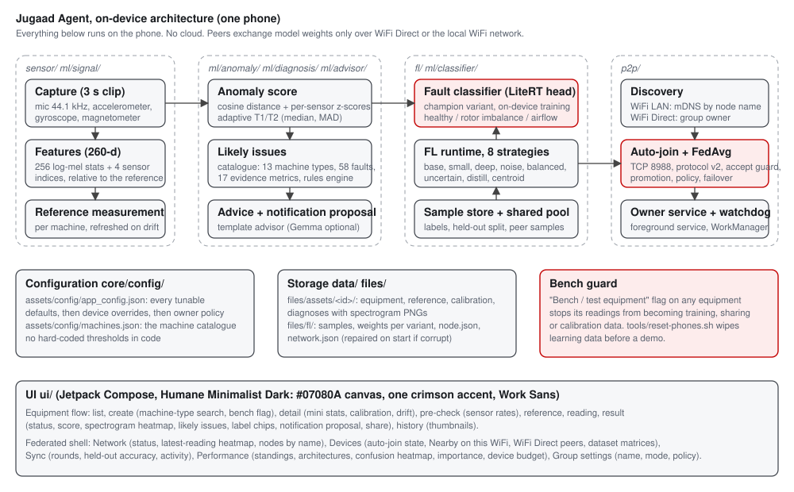
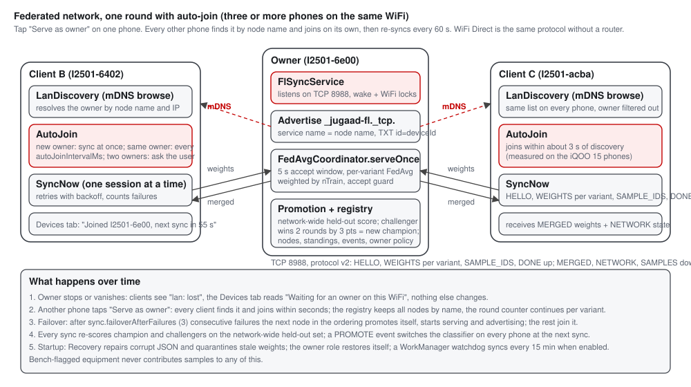

# Jugaad Agent

Jugaad Agent turns an ordinary Android phone, placed on a machine housing, into a vibration,
acoustic and magnetic sensor for rotating equipment. Each machine gets its own reference
measurement; every later reading is compared with that reference and reported as Healthy,
Warning or Critical with a score, a spectrogram, the likely issues from a machine catalogue and
a plain-language action. Three or more phones then train and merge a fault classifier between
themselves over WiFi Direct or the local WiFi network. Nothing leaves the phones; there is no
cloud and no server.

Built for the iQOO hackathon on three iQOO 15 phones (Snapdragon 8 Elite Gen 5, 16 GB,
Android 16). Everything described here has been verified on those phones; the evidence lives in
`plans/*.md` (Result sections) and `tools/devtest9/REPORT.md`.



## Key properties

- **Offline by design.** All capture, features, scoring, diagnosis, training and merging run on
  the phone. The only network traffic is phone to phone (model weights, standings, optional
  labelled samples). The `INTERNET` permission exists only because Android gates every socket on
  it; the app works with WiFi Direct in airplane mode.
- **Four sensors, one clip.** Microphone at 44.1 kHz, accelerometer, gyroscope and magnetometer
  are sampled over the same three seconds. Pre-check shows the measured rate of each.
- **Per-machine reference, not a global model.** A 260-dimension feature (256 log-mel statistics
  plus four sensor indices) is compared with the machine's own reference; thresholds calibrate
  themselves from the readings the technician labels (median and MAD), and the reference is
  refreshed when the machine drifts.
- **A catalogue, not a black box.** `assets/config/machines.json` holds 13 machine types and 58
  faults with keywords, evidence rules and actions. A rules engine ranks "Likely issues" from 17
  evidence metrics on every non-healthy reading. Adding a machine type is a JSON edit.
- **Federated self-improvement.** A LiteRT (TensorFlow Lite 2.16.1) classifier head is trained on
  the phone with signature-based training. Eight strategies compete as champion and challengers;
  the network promotes a challenger that beats the champion on the network-wide held-out set
  twice by 3 points, and every phone switches at its next sync.
- **Find each other by name, join automatically.** On the same WiFi, one tap of "Serve as owner"
  is the whole setup: every other phone discovers the owner by node name over mDNS and syncs to
  it within seconds, then every 60 s. WiFi Direct remains for places without a router.
- **Self-healing.** Corrupt state files are repaired at start, stale weights quarantined, the
  owner role restores itself, syncs retry with backoff, a client promotes itself after three
  failed syncs, and a WorkManager watchdog keeps syncing in the background.
- **Nothing hard-coded.** Every tunable is in `assets/config/app_config.json`, layered as
  defaults, then device overrides, then the owner's replicated policy.
- **Honest training data.** A "Bench / test equipment" flag on any equipment keeps its readings
  out of training, sharing and calibration, so table tests never teach the model.

## Workflow on one phone

| Step | Screen | What happens |
|---|---|---|
| 1. New equipment | Create equipment | Name it, search the catalogue for the machine type (keywords like "pump", "filtration"), mark it as bench equipment if it is a test rig. |
| 2. Pre-check | Pre-check | Microphone permission, the four sensors with their measured rates, a reference present, phone resting still. |
| 3. Reference measurement | Reference | Three clips while the machine runs normally; stores the mean feature, the spread of the healthy cluster and the sensor index statistics. |
| 4. Reading | Reading | One three-second clip. Anomaly score against the reference, per-sensor z-scores, classifier label when not healthy, likely issues, advice. |
| 5. Result | Result | Status chip and score, spectrogram heatmap, likely issues with keyword chips and actions, label chips (confirming a label feeds training), notification proposal, share. |
| 6. Calibration | Equipment detail | After a few labelled readings the thresholds T1/T2 recalibrate; drift shows a banner with a one-tap reference refresh. |
| 7. History | History | Every reading with its status and a spectrogram thumbnail. |

## The federated network



Open **Federated network** from the equipment list. Four tabs plus Group settings:

- **Network**: status chip, nodes online and round, the latest reading's spectrogram, the node
  list by name with role and held-out accuracy, experimental against stable cohorts.
- **Devices**: the auto-join state ("Waiting for an owner on this WiFi", "Joining X", "Joined X,
  next sync in N s", "Serving; other phones on this WiFi join this one"), "Nearby on this WiFi"
  (owners advertised by node name), WiFi Direct peers, the dataset and peer-sample matrices,
  "Serve as owner", "Sync now", "Create group".
- **Sync**: rounds per variant, held-out accuracy and loss, last trained, activity (MERGE,
  PROMOTE, FAILOVER, RECOVER events).
- **Performance**: standings, the eight architectures with their scores, confusion heatmap,
  feature importance by sensor group, device budget (SoC, threads, thermal, battery).
- **Group settings**: node name, experimental or stable mode, pinned challenger, auto-train,
  sample sharing, owner policy.

How a round works: clients send HELLO plus their weights per variant (and offered sample ids);
the owner merges each variant with FedAvg weighted by training-set size, rejects merges that
fail the accept guard, rescores champion and challengers, decides promotions, and replies with
the merged weights, the network state and any requested samples. Protocol v2 with `JGFL` framing
on TCP port 8988, retries with backoff, one client session at a time per phone.

Strategies: `base` (260-64-3, the champion by default), `small` (260-32-3), `deep`
(260-64-32-3), `noise` (input-noise augmentation), `balanced` (class-balanced batches),
`uncertain` (trains only when uncertainty is high), `distill` (EMA self-distillation), `centroid`
(nearest-centroid, no gradient). All use early stopping, weight decay and a held-out split; the
heads ship pretrained on the public MAFAULDA dataset (`ml/data/README.md`).

## Design language

Humane Minimalist Dark: `#07080A` canvas, `#111317` cards, one crimson accent `#C30000`, bundled
Work Sans variable font, large numerals, borderless rows, status chips that never wrap. The
spectrogram heatmap is the visual centrepiece of every reading screen. UI strings contain no em or
en dashes. Vocabulary follows plant maintenance practice: equipment, measurement document,
notification proposal.

## Module layout

```
app/src/main/java/com/jugaad/agent/
  core/            Constants, Outcome, Logx (every log line is tagged JUGAAD)
  core/config/     AppConfig, ConfigStore (defaults > overrides > owner policy), MachineCatalog
  sensor/          AudioCapture, MotionCapture (accel, gyro, mag on one thread), CaptureCoordinator
  ml/signal/       Hann window, mel filter bank, log-mel spectrogram, vibration and magnetic indices
  ml/anomaly/      AnomalyScorer (cosine + z-scores), thresholds
  ml/diagnosis/    EvidenceExtractor (17 metrics), RulesEngine over the catalogue
  ml/classifier/   FaultClassifier interface, LiteRT federated head, heuristic fallback
  ml/advisor/      TemplateAdvisor (default), GemmaAdvisor (optional, flag)
  fl/              FlRuntime, FlVariants, VariantTrainer, EarlyStopping, RecipeBatching, Promotion,
                   StrategyRank, Cohorts, TrainBudget, SampleStore, SharedPool, FeatureImportance,
                   AcceptGuard, Recovery, NodeConfig, NetworkState, AutoTrainer, CentroidStrategy
  p2p/             WifiDirectManager, LanDiscovery (mDNS), AutoJoin, SyncNow, SyncProtocol,
                   FedAvgCoordinator, FlSyncService, Failover, SyncWorker, SyncScheduler, SyncBus
  domain/          models, repository interfaces, use cases (diagnose, calibrate, refresh reference)
  data/            DTOs, JSON file store, repository implementations
  viz/             spectrogram and report renderers
  ui/              theme, common components (ui/common/fiori, the name is historical), one package
                   per equipment screen, ui/network (federated shell), ui/nav
  di/              ServiceLocator (composition root; starts AutoTrainer and AutoJoin)
app/src/main/assets/
  config/          app_config.json, machines.json
  models/          fl_head_base|small|deep.tflite (pretrained on MAFAULDA)
app/src/test/      171 JVM tests: protocol, FedAvg, promotion, calibration maths, rules engine,
                   sample store, recovery, failover, LAN discovery picker, auto-join planner
ml/                Python: MAFAULDA ingest, pretraining, head export, network simulator, field ingest
plans/             one contract per goal, each ending with a verified Result section
tools/             reset-phones.sh, devtestN/REPORT.md evidence
docs/              architecture.svg, network-flow.svg, the original 10 Sep status document
```

## Building

Requirements: JDK 17, Android SDK 35 (platform-tools, `platforms;android-35`, build-tools 35.x),
the Gradle wrapper in the repo. Write `local.properties` with `sdk.dir=<path>`.

```bash
export JAVA_HOME=/path/to/jdk17; export PATH="$JAVA_HOME/bin:$PATH"
./gradlew :app:assembleDebug :app:testDebugUnitTest
```

The debug APK is `app/build/outputs/apk/debug/app-debug.apk`, package `com.jugaad.agent.debug`.
Python (3.12, TensorFlow 2.16.1) is only needed to re-bake the heads or run the simulator; see
`ml/README.md` and `ml/fl/README.md`.

Optional runtimes behind `gradle.properties` flags: `jugaad.executorch.enabled` (an ExecuTorch CNN
path with QNN/XNNPACK backends, kept from the first prototype) and `jugaad.gemma.enabled` (Gemma
advice through MediaPipe). Both are off; the shipped path is LiteRT plus the template advisor.

## Running on the phones

```bash
adb tcpip 5555 && adb connect <phone-ip>:5555        # once per phone, then wireless
bash tools/reset-phones.sh --keep-equipment            # wipe learning data, reinstall, relaunch
adb -s <serial> logcat -s JUGAAD:*                     # proof lines
```

Demo in one line: on one phone open Federated network, Devices, tap "Serve as owner"; watch the
other phones report "Joined <name>" and the owner count "3 active devices". Full run sheet in
`DEMO.md`, deeper mechanics and proof lines in `FEDERATED.md`.

## Documentation map

| File | What it is |
|---|---|
| `CONTEXT.md` | How to continue the project in a fresh Claude session: rules, toolchain, phones, code map |
| `HANDOFF.md` | Current state, what was verified on hardware, open items |
| `FEDERATED.md` | The federated system in depth: model choice, strategies, protocol, run sheet, proof lines |
| `ARCHITECTURE.md` | End-to-end architecture snapshot with file references |
| `DEMO.md` | Demo run sheet and talking points |
| `HACKATHON.md` | Provenance rule, judging plan |
| `plans/` | Contracts v1 to v6 with verified Result sections |
| `ml/data/DATASETS.md` | Public dataset survey and why MAFAULDA |
| `docs/PROJECT_STATE.md` | The original 10 Sep status document (superseded by HANDOFF.md) |

## Status

Verified on hardware on 2026-09-12: sensors and calibration, catalogue diagnosis, on-device
training with promotion, three-phone federated rounds over WiFi Direct and over the WiFi LAN,
automatic discovery and joining by node name, failover, recovery, the bench guard and the
Humane Minimalist Dark UI. Open: the v5.1 UI fixes are covered by tests but their on-device
re-check was cut short, Airflow Obstruction has no public labelled data (learnt from technician
labels), and phones on an access point with client isolation must use WiFi Direct.
